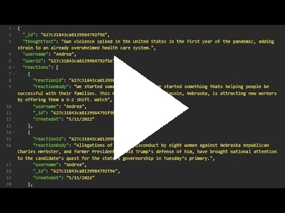

# Amazing-Ecommerce-Back-End
This is an exercise for a Georgia Tech Full Stack Development Bootcamp Section

## Video Demonstration   
   

Time |   Requirement
-----|----------------
0:31 | The walkthrough video must demonstrate how to seed the database from the command line.

The walkthrough video must demonstrate how to start the application’s server.

The walkthrough video must demonstrate GET routes for all categories, all products, and all tags being tested in Insomnia.

The walkthrough video must demonstrate GET routes for a single category, a single product, and a single tag being tested in Insomnia.

The walkthrough video must demonstrate POST, PUT, and DELETE routes for categories, products, and tags being tested in Insomnia.
